# 급식 메뉴 사진 미리보기

## 1. 밥
---

### 곤드레밥
---

### 기장밥
---

### 김치볶음밥
---

### 깍두기볶음밥
---

### 날치알밥
---

### 닭고기덮밥
---

### 매콤닭갈비덮밥
---

### 미트소스스파게티_또띠아
---

### 발아현미밥
---

### 버섯콩나물밥
---

### 보리밥
---

### 볶음밥
---

### 브로콜리새우볶음밥
---

### 비빔밥
---

### 새싹비빔밥
---

### 새우볶음밥
---

### 소고기덮밥
---

### 쇠고기김치볶음밥
---

### 스크램블에그_새우볶음밥
---

### 시래기밥_양념장
---

### 쌀밥
---

### 야채볶음밥
---

### 오므라이스
---

### 자장밥
---

### 짜장덮밥
---

### 짜장밥
---

### 찰현미밥
---

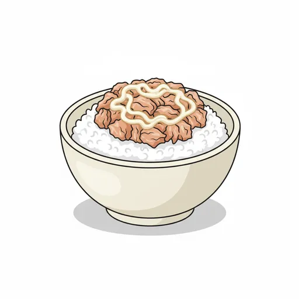
### 참치마요덮밥
---

### 참치야채비빔밥
---

### 찹쌀밥
---

### 치즈함박볶음밥
---

### 치킨마요덮밥
---

### 카레밥
---

### 콩나물밥_양념장
---

### 하이라이스
---

### 현미찹쌀밥
---

### 혼합잡곡밥
---

### 흑미밥
---

### 흰쌀밥
---

## 2. 국
---

### 감자국
---

### 건새우아욱국
---

### 근대된장국
---

### 김치만두국
---

### 꽃게탕
---

### 냉국
---

### 냉이된장국
---

### 닭개장
---

### 닭곰탕
---

### 닭육개장
---

### 닭칼국수
---

### 돈육고추장찌개
---

### 돈육김치찌개
---

### 동태찌개
---

### 된장찌개
---

### 들깨무채국
---

### 맑은순두부국
---

### 물만두국
---

### 미소장국
---

### 미역국
---

### 바지락순두부찌개
---

### 배추된장국
---

### 부대찌개
---

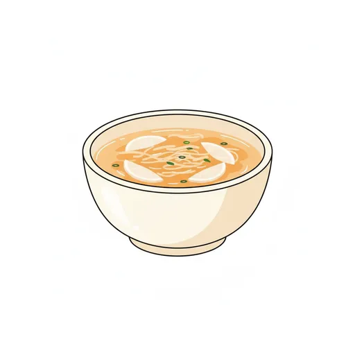
### 북어채무국
---

### 북어콩나물국
---

### 브로콜리크림스프
---

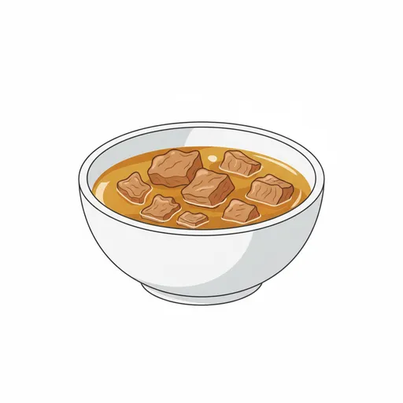
### 뼈없는갈비탕
---

### 사골우거지국
---

### 삼계탕
---

### 소고기육개장
---

### 쇠고기떡국
---

### 쇠고기무국
---

### 쇠고기미역국
---

### 쇠고기버섯전골
---

### 순대국
---

### 순두부찌개
---

### 시금치된장국
---

### 시락국
---

### 아욱국
---

### 어묵국
---

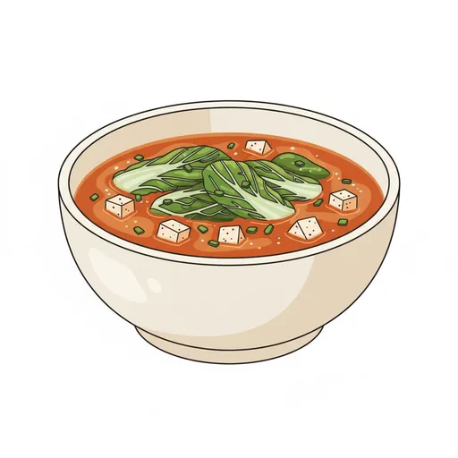
### 얼갈이된장국
---

### 오리탕
---

### 오징어국
---

### 옹심이만두국
---

### 우동국
---

### 육개장
---

### 재첩국
---

### 짬뽕국
---

### 참치김치찌개
---

### 청국장찌개
---

### 콩가루배추국
---

### 콩나물국
---

### 콩나물김치국
---

### 콩비지찌개
---

### 팽이버섯된장국
---

### 해물누룽지탕
---

### 호박잎된장국
---

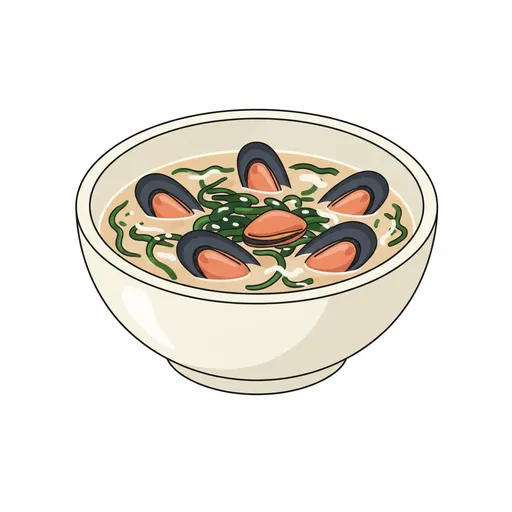
### 홍합미역국
---

### 황태미역국
---

### 황태채계란국
---

## 3. 김치
---

### 깍두기
---

### 깻잎지
---

### 나박김치
---

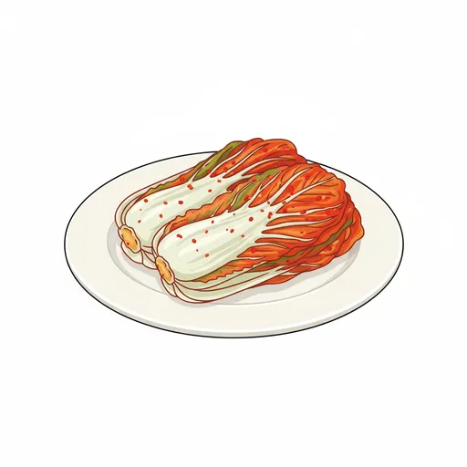
### 배추김치
---

### 섞박지
---

### 열무김치
---

### 오이소박이
---

### 총각김치
---

## 4. 메인
---

### 가자미구이
---

### 갈비만두찜
---

### 갈치구이
---

### 계란말이
---

### 고등어구이
---

### 고추잡채_꽃빵
---

### 깐쇼새우
---

### 꽁치구이
---

### 낙지볶음
---

### 너비아니구이
---

### 닭가슴살볶음
---

### 닭갈비
---

### 닭갈비볶음
---

### 닭꼬치
---

### 닭날개튀김
---

### 닭다리바베큐구이
---

### 닭다리오븐구이
---

### 닭볶음탕
---

### 닭봉조림
---

### 닭윙조림
---

### 돈까스
---

### 돈육고추장볶음
---

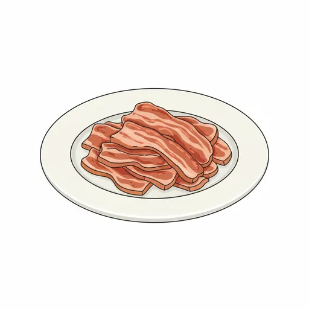
### 돈육불고기
---

### 동그랑땡
---

### 동태전
---

### 돼지갈비찜
---

### 떡갈비
---

### 떡갈비_허니머스타드
---

### 매콤돈육고추장볶음
---

### 바베큐닭다리구이
---

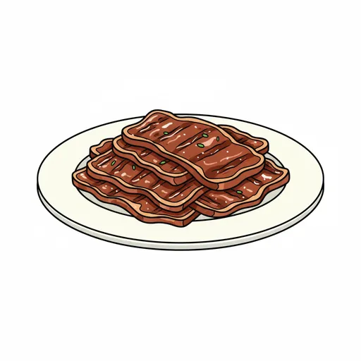
### 불고기
---

### 삼치구이
---

### 생선까스
---

### 생선까스_타르타르소스
---

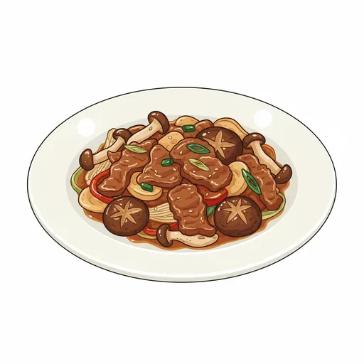
### 소고기버섯볶음
---

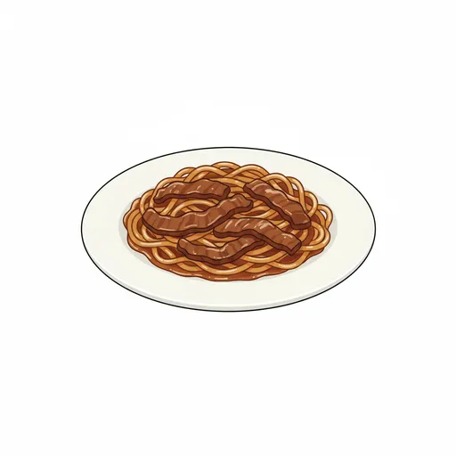
### 쇠고기당면찜
---

### 쇠고기장조림
---

### 쇠고기폭찹
---

### 수제떡갈비
---

### 수제소시지볶음
---

### 순살치킨
---

### 스파게티
---

### 안동찜닭
---

### 연어스테이크
---

### 오리불고기
---

### 오리훈제
---

### 오리훈제_머스타드소스
---

### 오삼불고기
---

### 오징어_청경채볶음
---

### 오징어튀김
---

### 자반고등어구이
---

### 잡채
---

### 장조림
---

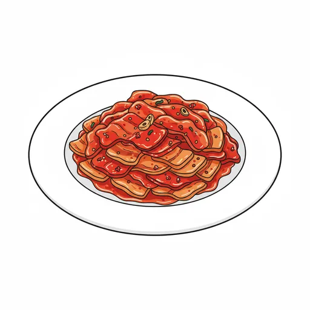
### 제육볶음
---

### 쭈꾸미볶음
---

### 치즈불닭
---

### 치킨텐더_허니머스타드
---

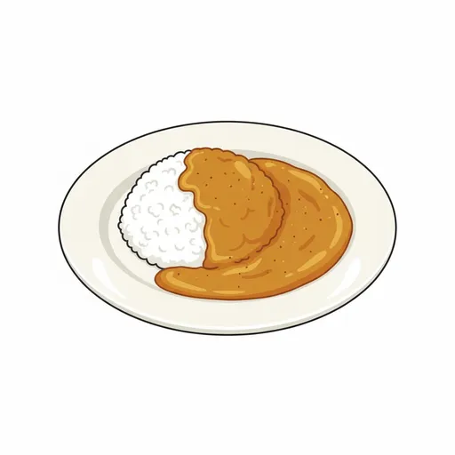
### 카레라이스
---

### 코다리강정
---

### 크림스파게티
---

### 탕수육
---

### 폭찹
---

### 함박스테이크
---

### 해물볶음우동
---

### 해물스파게티
---

### 해물찜
---

### 해물파전
---

## 5. 반찬
---

### 가지나물
---

### 감자조림
---

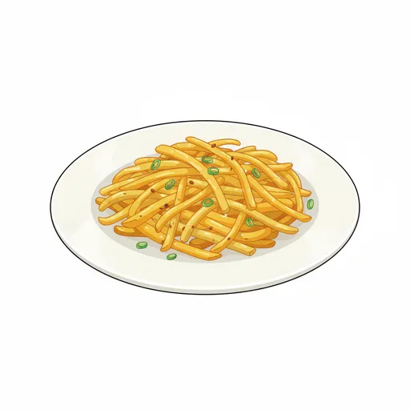
### 감자채볶음
---

### 감자튀김
---

### 건파래볶음
---

### 계란장조림
---

### 계란찜
---

### 고구마순볶음
---

### 고사리나물
---

### 곤약야채무침
---

### 김가루
---

### 김무침
---

### 김치전
---

### 깻잎순볶음
---

### 꼬막무침
---

### 꼬막양념무침
---

### 꽈리고추멸치볶음
---

### 꽈리고추찜
---

### 느타리버섯볶음
---

### 다시마튀각
---

### 단무지무침
---

### 단호박범벅
---

### 달걀장조림
---

### 달래오이무침
---

### 닭가슴살샐러드
---

### 닭가슴살채소볶음
---

### 도라지나물
---

### 도토리묵
---

### 도토리묵_양념장
---

### 두부조림
---

### 마늘쫑볶음
---

### 만두튀김
---

### 맛살계란말이
---

### 매실장아찌무침
---

### 메추리알조림
---

### 멸치볶음
---

### 명엽채볶음
---

### 무나물
---

### 무말랭이무침
---

### 무생채
---

### 무장아찌
---

### 묵은지볶음
---

### 미나리무침
---

### 미니닭봉조림
---

### 미역줄기볶음
---

### 버섯들깨볶음
---

### 버섯볶음
---

### 봄동겉절이
---

### 봄동나물
---

### 부추겉절이
---

### 브로콜리_초장
---

### 비엔나볶음
---

### 비엔나케첩조림
---

### 삼색나물
---

### 상추_치커리겉절이
---

### 상추겉절이
---

### 새우튀김
---

### 샐러드
---

### 숙주나물
---

### 시금치나물
---

### 시금치나물무침
---

### 시금치무침
---

### 시래기지짐
---

### 애호박볶음
---

### 야채겉절이
---

### 야채계란찜
---

### 야채튀김
---

### 양념감자
---

### 양념깻잎
---

### 양념도토리묵
---

### 양념두부
---

### 양배추샐러드
---

### 양배추찜_쌈장
---

### 양상추샐러드
---

### 어묵볶음
---

### 연근조림
---

### 연두부_양념간장
---

### 열무된장무침
---

### 오이깍두기
---

### 오이무침
---

### 오이부추무침
---

### 오이샐러드
---

### 오이생채
---

### 오이소박이무침
---

### 오이지무침
---

### 오징어젓갈
---

### 오징어채무침
---

### 오징어초무침
---

### 우엉채조림
---

### 유채나물
---

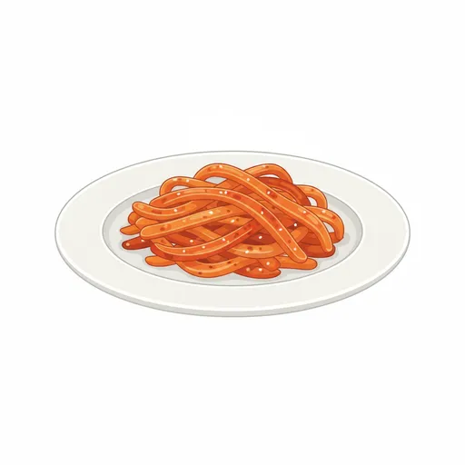
### 진미채무침
---

### 진미채볶음
---

### 참나물무침
---

### 청경채겉절이
---

### 청경채나물
---

### 청포묵무침
---

### 취나물
---

### 치커리사과샐러드
---

### 콘샐러드
---

### 콩고물멸치볶음
---

### 콩나물겨자채
---

### 콩나물무침
---

### 콩자반
---

### 탕평채
---

### 파래자반
---

### 파채
---

### 파프리카계란찜
---

### 파프리카잡채
---

### 풋고추찜
---

### 해물까스_소스
---

### 해물볶음
---

### 햄감자채볶음
---

### 호박나물
---

### 호박새우젓볶음
---

## 6. 기타
---

### 계란후라이
---

### 과일샐러드
---

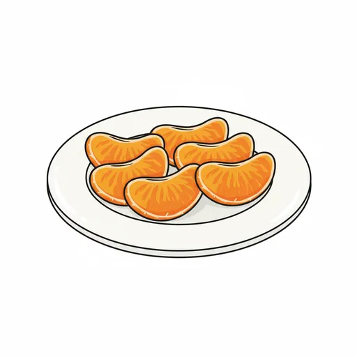
### 귤
---

### 김가루주먹밥
---

### 꿀떡
---

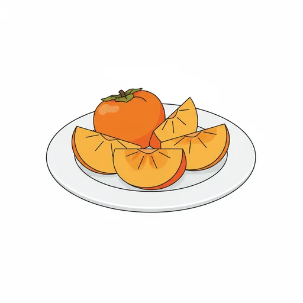
### 단감
---

### 닭강정
---

### 떠먹는 요구르트
---

### 떠먹는요거트
---

### 떠먹는요구르트
---

### 떡꼬치
---

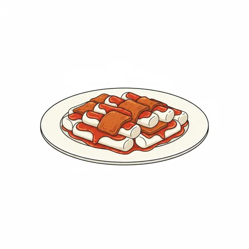
### 떡볶이
---

### 마시는요구르트
---

### 만두
---

### 만두강정
---

### 망고샐러드
---

### 머핀
---

### 멜론
---

### 미니롤케익
---

### 미니슈
---

### 미니쌀핫도그
---

### 미니컵라면
---

### 미니파인애플
---

### 미니피자
---

### 미니핫도그
---

### 미니햄버거
---

### 미숫가루
---

### 바나나
---

### 바나나우유
---

### 방울증편
---

### 방울토마토
---

### 베이글_크림치즈
---

### 베이컨계란토스트
---

### 베이컨토스트
---

### 비빔냉면
---

### 비피더스
---

### 쁘띠첼
---

### 사과
---

### 사과당근주스
---

### 사과주스
---

### 사과파이
---

### 새우버거
---

### 샌드위치
---

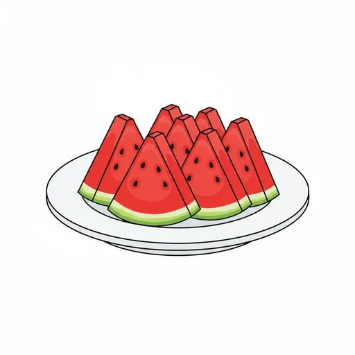
### 수박
---

### 수수팥경단
---

### 스위트번
---

### 스크램블에그
---

### 스트링치즈
---

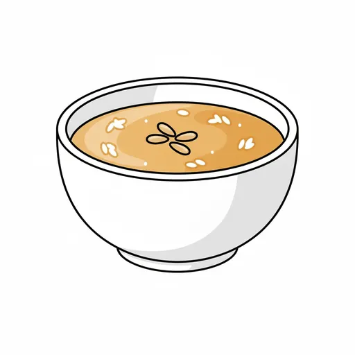
### 식혜
---

### 식혜_귤
---

### 쌀과자
---

### 쌀쿠키
---

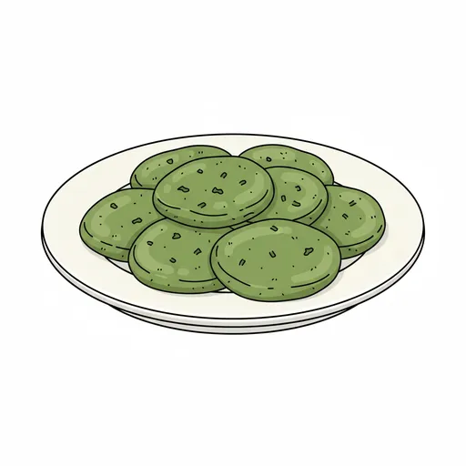
### 쑥개떡
---

### 씨리얼
---

### 아이스크림
---

### 아침밥_유기농식혜
---

### 에그타르트
---

### 오렌지
---

### 오렌지주스
---

### 오이도나스
---

### 옥수수수염차
---

### 와플
---

### 요거트
---

### 요구르트
---

### 요플레
---

### 우유
---

### 우유_시리얼
---

### 웨지감자
---

### 자몽주스
---

### 젤리
---

### 조각케익
---

### 조각피자
---

### 주스
---

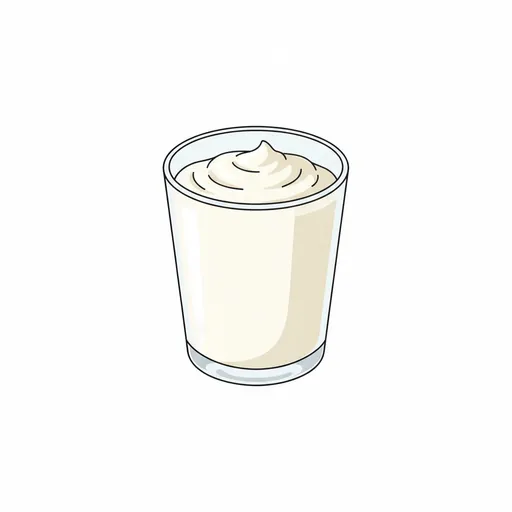
### 짜먹는요거트
---

### 짜장면
---

### 쫄면
---

### 찐만두
---

### 찐빵
---

### 찹쌀도넛
---

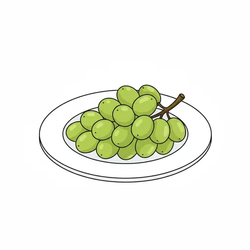
### 청포도
---

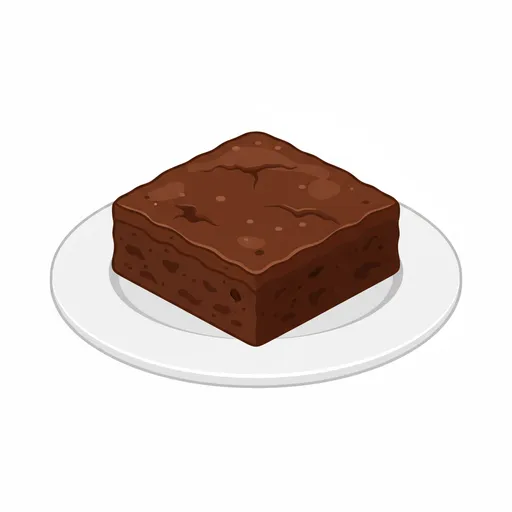
### 초코브라우니
---

### 초코우유
---

### 초코칩쿠키
---

### 초코케이크
---

### 초콜릿우유
---

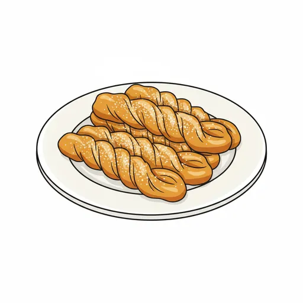
### 츄러스
---

### 치즈스틱
---

### 치즈타르트
---

### 치킨너겟_머스타드
---

### 컵과일
---

### 케이크
---

### 콘치즈
---

### 콩가루바나나
---

### 쿠키
---

### 크로와상
---

### 크림스프
---

### 크림치즈와플
---

### 토마토샐러드
---

### 토스트
---

### 튀김만두
---

### 파닭_소스
---

### 파인애플
---

### 팥빙수
---

### 팥빵
---

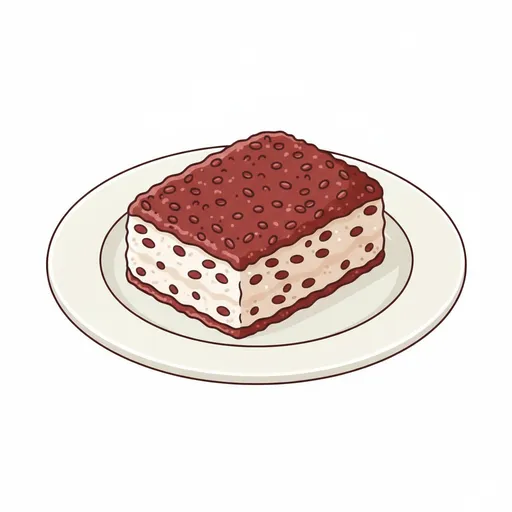
### 팥시루떡
---

### 포도
---

### 포도주스
---

### 포테이토샐러드
---

### 피자
---

### 핫도그_케첩
---

### 핫초코
---

### 햄치즈토스트
---

### 호떡
---
